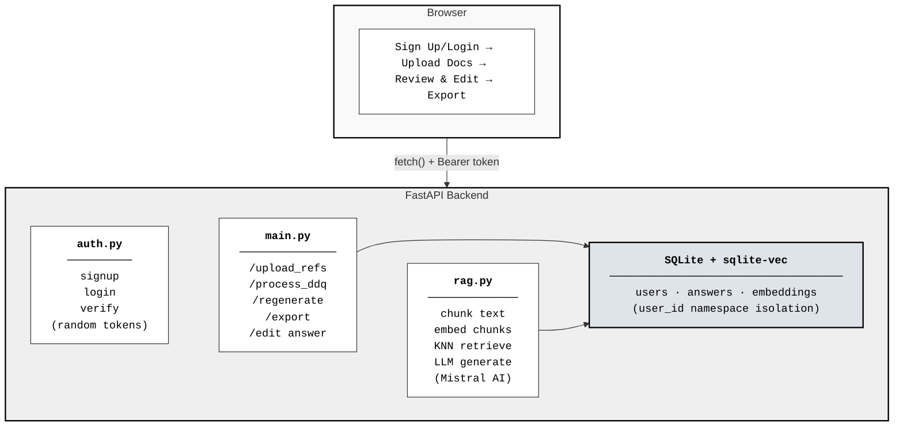

# Sterling Oak DDQ Automator


## The Company
Sterling Oak Wealth Partners is a boutique institutional asset manager overseeing $14.2 billion in fixed-income portfolios. The firm regularly receives highly standardized Due Diligence Questionnaires (DDQs) from pension funds, endowments, and regulatory bodies covering everything from cybersecurity and disaster recovery to ESG policies and investment allocation limits. Completing these questionnaires currently involves manually cross-referencing internal policy documents — a process that takes hours per questionnaire. This tool automates that entire workflow.

---

## What I Built

At its core, this is a RAG (Retrieval-Augmented Generation) pipeline wrapped in a full-stack web application.

The problem is simple: compliance teams receive long, structured questionnaires and need to answer each question using approved internal documentation. Doing this manually means opening 3-8 policy documents and hunting for the right paragraph for every single question. Sterling Oak DDQ Automator does that automatically.

Here's how it works:
- You upload your internal reference documents (policy files, compliance docs, operational guidelines) — the system chunks them and creates vector embeddings using Mistral's embedding API
- Each user's embeddings are stored separately, so there's full data isolation between accounts
- When you upload a questionnaire (.docx with a two-column table), it parses out each question and runs a KNN similarity search against your reference chunks
- The top matching chunks get passed to Mistral's LLM, which generates a concise, professional answer using only that context
- If no relevant reference material exists for a question, it honestly returns "Not found in references." instead of making something up
- Everything gets saved to a SQLite database so answers persist across sessions



---

## Features

- **User auth** — sign up and log in, each user's data is fully isolated
- **Upload questionnaire + references** — `.docx` files, questionnaire must be a two-column table
- **AI-generated answers** — grounded in your documents, never made up
- **Source citations** — every answer tells you which document it came from
- **Confidence scores** — so you know how strongly the answer is supported
- **Evidence snippets** — see the exact passage from the reference doc that was used
- **Edit answers** — review and tweak any answer before exporting
- **Regenerate individual answers** — re-run just one question without redoing everything
- **Coverage summary** — dashboard showing total questions, sourced answers, and gaps at a glance
- **Export to Word** — downloads the original `.docx` with answers and citations filled in

---

## Tech Stack

| Layer | What I used |
|---|---|
| Backend | FastAPI + SQLAlchemy (SQLite) |
| AI / LLM | Mistral AI — `mistral-small-latest` |
| Embeddings | Mistral AI — `mistral-embed` (1024 dims) |
| Vector search | `sqlite-vec` (KNN via vec0 virtual table) |
| Auth | `secrets.token_hex` + `passlib` (SHA-256 hashed passwords) |
| Export | `python-docx` |
| Frontend | Single `index.html` — vanilla JS + CSS, no build step |

---

## How to Run It

### 1. Set up the project

```bash
git clone <repo-url> && cd sterling-oak-ddq

python -m venv venv
venv\Scripts\activate        # Windows
pip install -r requirements.txt
```

### 2. Add your Mistral API key

Get a free key from [console.mistral.ai](https://console.mistral.ai), then:

```bash
echo MISTRAL_API_KEY=your_key_here > .env
```

### 3. Start the app

```bash
uvicorn backend.main:app --reload
```

Open **http://localhost:8000** in your browser.

---

## Using the App

1. **Sign up** on the login page
2. **Upload your reference documents** — the `.docx` files that contain your source of truth (policy docs, compliance guidelines, etc.)
3. **Upload your questionnaire** — a `.docx` with a two-column table (questions in column 1, blank column 2)
4. **Click Generate Answers** — takes about 10-15 seconds for 10 questions
5. **Review the results** — each answer shows the source citation, confidence score, and an expandable evidence snippet
6. **Edit anything** that needs tweaking directly in the browser and hit Save
7. **Export** — download a `.docx` file with the completed questionnaire preserving the original structure

---

## Assumptions I Made

- Questionnaires are `.docx` files with a two-column table (question | answer) — I kept this specific because the export needs to preserve the exact original structure
- Reference documents are text-heavy `.docx` policy files — no complex tables or embedded images
- SQLite is fine for a demo — a real deployment would use PostgreSQL
- Mistral's free API tier is sufficient — rate limits haven't been an issue with normal usage

---

## Trade-Offs

- **Single HTML vs. React** — prioritized backend RAG quality over frontend polish. A single vanilla JS file runs instantly without `npm install` and is easy to review
- **SQLite + sqlite-vec vs. Pinecone** — keeps everything in a single portable `.db` file with zero infrastructure
- **Mistral vs. local models** — API-based means no GPU required and consistent quality, but does need internet access
- **Random tokens vs. JWT** — simpler to implement, tokens are rotated on login. In production this would use proper JWTs with expiry

---

## What I'd Improve With More Time

- **PDF support** for both questionnaires and reference docs — most real compliance docs are PDFs
- **Streaming answers** so results appear question by question instead of waiting for all of them
- **Hybrid search** — combining vector similarity with BM25 keyword search would improve retrieval for exact acronyms and numbers
- **Version history** — save timestamped snapshots so teams can compare answer sets across runs
- **JWT auth with refresh tokens** instead of simple random tokens
- **Background job queue** (like Celery) so answer generation runs async and the browser doesn't have to stay open